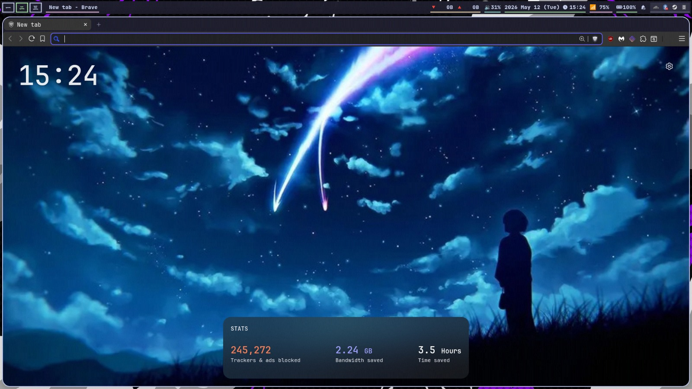

# Brave Origin for All

This allows you to get the same clean version of Brave browser which Brave Origin provides for free.



## Installing

### Linux

```sh
curl -sL "https://github.com/DemonKingSwarn/brave-origin-for-all/raw/refs/heads/master/brave.sh" | sudo bash -
```

### Windows

- Launch the Terminal app as admin

```powershell
irm https://github.com/DemonKingSwarn/brave-origin-for-all/raw/refs/heads/master/brave.ps1 | iex
```
